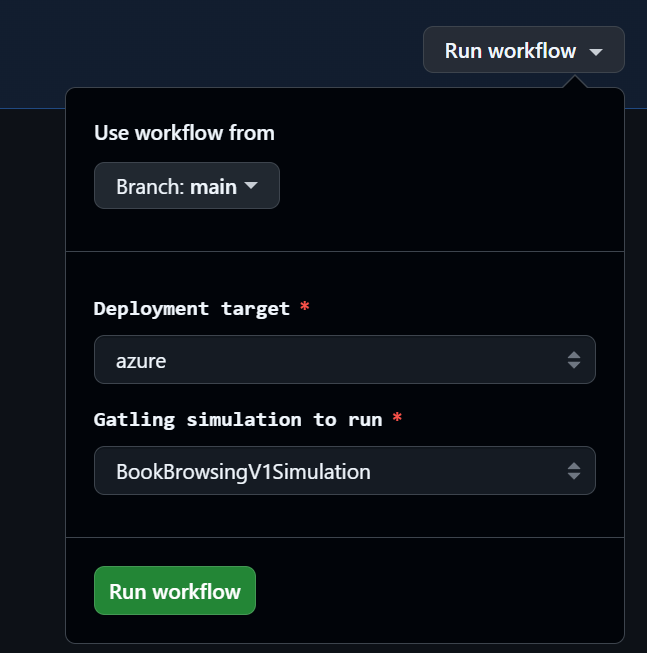

# Stop praying, start testing

## Reliable Performance Testing with Gatling

---

# Outline

- When and why performance testing matters
- Your first performance test
- Refactoring your first performance test
- How to make the codebase more maintainable using code generation
- How to model your tests correctly
- How to implement CI
- How to solve common problems in performance testing

---

# When and why performance testing matters

- An application with poor performance slows down the user and also the developers
- Poor performance leads to longer development times because manual and automated tests take longer
- Crucial for usability
- ISO 9241-11 Ergonomics of human-system interaction
    - Effectiveness
    - Efficiency
    - Satisfaction
-
- https://arxiv.org/abs/2408.12736
- https://www.sciencedirect.com/science/article/abs/pii/S0164121207000088

---

# Your first performance test

```kotlin
object FirstSimulation : Simulation() {
    private val browse = scenario("Browse Books V1") // define the workflow that should be tested
    /* ... */

    fun getBooks(): ChainBuilder { /* ... */
    } // define a single request

    val HTTP_PROTOCOL = HttpDsl.http
        .baseUrl(BASE_URL) // Url to your application
        .acceptHeader("application/json")
        .contentTypeHeader("application/json")

    init {
        setUp(browse.injectOpen(rampUsers(10_000).during(20.seconds))) // define injection profile and number of users
            .protocols(HTTP_PROTOCOL)
            .assertions(/* ... */)
    }
}
```

---

# Your first performance test

```kotlin
object FirstSimulation : Simulation() {
    private val browse = scenario("Browse Books V1") // define the workflow that should be tested
        .exec(
            group("Browse Books").on( // grouping makes it easier to read the results
                exec(getBooks()), // execute the getBooks request defined below
                pause(1), // pause for one second
                exec(getBooks())
            )
        )

    fun getBooks(): ChainBuilder { // define a single request
        return exec(
            http("getBooks")
                .get("${Constants.BASE_URL}/books")
                .queryParam("page", 1)
                .queryParam("size", 10)
                .check(status().`is`(200)) // checks the response body
        )
    }

    init {
        setUp(browse.injectOpen(rampUsers(10_000).during(20.seconds))) // define injection profile and number of users
            .protocols(HTTP_PROTOCOL)
            .assertions(
                global().responseTime().max()
                    .lt(100), // You need to define values according to your business requirements
                global().responseTime().mean().lt(50),
                global().successfulRequests().percent()
                    .gt(95.0), // Under load some requests might fail. That can always happen
            )
    }
}
```

--- 

# How Gatlings session works

- essentially a map storing data that can be used in requests
- Write: `check(jsonPath().saveAs()) / set inside of exec`
- Read: `"#{}"` / `get` inside of exec


- ```kotlin
  fun getBooks(page: Int? = null, size: Int? = null): ChainBuilder {
        var req = http("getBooks").get("$baseUrl/books")
        if (page != null) req = req.queryParam("page", page)
        if (size != null) req = req.queryParam("size", size)
        return exec(Authentication.ensureValidToken)
            .exec(req
                .check(statusIs(200))
                .check(jsonPath("$.content").saveAs("content"))
                .check(jsonPath("$.totalElements").saveAs("totalElements"))
                .check(jsonPath("$.totalPages").saveAs("totalPages"))
                .check(jsonPath("$.size").saveAs("size"))
                .check(jsonPath("$.number").saveAs("number"))
            )
    }
  ```

---

# Refactoring our simulation

- Extract getBooks() into separate page object
- Define response time assertions as a constant
- Define load sizes as constants

---

# Make the repo maintainable

- extract Http Calls using the Page-Object pattern
    - Create a class for each controller in your backend that simulates its endpoints
- Generate page objects automatically from OpenAPI spec
    - Generate OAS Schema by backend or do spec first
    - Tell an AI agent to write page objects accordingly or tell AI to write a gradle task which automatically converts
      the code
    - Prompt: TODO

---

# Generate page objects from OpenAPI spec

TODO

---

# Integrate gatling in your CI pipeline

- Run application and gatling locally for testing purposes
- Run application and gatling in Pipeline for CI quality gates
- Run application on a dedicated server and gatling in pipeline for dedicated tests
- Run gatling against prod environment for dedicated tests (analyze when a good time is beforehand)
- Always monitor your application during performance tests

- How?
    - The same way you would do locally
    - Run your application using docker
    - Wait for the application to be ready using a custom bash probe
    - Seed data if necessary
    - Run the performance test
    - Store the report and monitoring data

---

# Integrate gatling in your CI pipeline

- Some tests should be part of the build pipeline
- You should have the possibility to run a specific test against a specific stage with the press of a button and receive
  the gatling report and monitoring data
- You can define simulations that should be run during the night



---

# Considerations when integrating gatling in your CI pipeline

- Pipeline runtime should be low. So maybe you dont want it to be an automatic CI task
- Manual or nightly executions are good alternatives to a separate build step
- Your approach is going to depend on how critical performance really is for your application
- Maybe performance is not just a quality metric for you but actually a functional requirement. Then it should be run as
  a separate build step
    - Examples: Ticketing system. If it can't handle realistic spikes, its kind of useless, because no one will be able
      to use it then

---
layout: section
---

# How to create realistic simulations

## Different kinds of performance tests

---

# Different kinds of performance tests

- Load tests: Can the system manage a certain load
- Spike tests: Can the system respond to sudden bursts of peak loads
- Stress tests: Handle peak loads that are beyond the limits of anticipated loads
- Scalability tests: How well can the system grow
- Concurrency tests: Does the system still behave correctly with many concurrent users

---

# Translating kind of performance test into Gatling

- You need monitoring as a prerequisite
- Load profiles
    - Define an expected average load according to your monitoring data
    - Define an expected peak load according to your monitoring data
- Define acceptable response time limits for your application (business consideration)
- Define injection profiles that model your type of performance test

---

# Gatlings injection profiles for modelling different kinds of performance tests

| Profile               	   | Description	                        | Use Case                 |
|---------------------------|-------------------------------------|--------------------------|
| constantUsersPerSec       | Constant rate of users per second	  | Sustained load testing   |
| rampUsers               	 | Gradually increase users over time	 | Realistic traffic growth |
| atOnceUsers               | All users start at once	            | Spike testing            |
| stressPeak                | Peak stress pattern	                | Find breaking points     |

[https://docs.gatling.io/ai/assistant/vscode/create-simulation/#step-3-injection-profile]

---

# Examples for injection profile usages

- Scenario 1: You want to test if the book store can handle the average amount of users properly
    - You start with rampUsers for a few seconds then continue with constantUsersPerSec
    - You should look into your monitoring application to figure out the average amount of users
- Scenario 2: You want to test if there are memory leaks in the book store application
    - You run the constantUsersPerSec for a very long time, for example for two hours against a dedicated machine
    - You monitor memory usage and see if the memory usages increases significantly over time
    - You can do this with different sets of requests to figure out which requests cause issues
    - Once you have found significant increased memory usages you should run the application locally and use the
      profiler to investigate further
- Scenario 3: The book store now sells tickets for signature sessions with authors and you want to make sure that the
  application can handle peaks when the sale starts
    - You need to guess the amount of users that try to login at peak times
    - You use atOnceUsers and see if the application can handle the load
    - In the future when you have some data about how many people tend to login at peak times you can take that number
      for the test

---
layout: section
---

# How to solve common problems

## Authentication and test data generation

---

# How to test endpoints that need authentication

- Login request at the start of the simulation: `exec(Authentication.login(username, password))`
- Before every request that needs to be authenticated: `exec(Authentication.ensureValidToken)`
- Add Authorization Header to every request by adding it to the HTTP_PROTOCOL constant
- Remove Authorization Header from login and refresh calls with `header("Authorization", "")`

BrowseBooksSimulation.kt

```kotlin
scenario("Browse Books")
    .exec(Authentication.login("username", "password")) // call login at the start of the scenario
    .exec(browseBooks())
```

BooksPage.kt

```kotlin
fun getAllBooks(): ChainBuilder {
    var req = http("getAllBooks").get("$baseUrl/v1/books")
    return exec(Authentication.ensureValidToken) // call ensureValidToken before making request
        .exec(
            req
                .check(statusIs(200))
                .check(jsonPath("$[*]").ofList().saveAs("getAllBooksList"))
        )
}
```

---

# How to test endpoints that need authentication

```kotlin
fun login(username: String, password: String): ChainBuilder = exec(
    http("Login")
        .post(TOKEN_URL) // keycloak for example
        .header("Content-Type", "application/x-www-form-urlencoded")
        .header("Authorization", "") // authorization header should not be set here
        .formParam("grant_type", "password") // start of credentials
        .formParam("client_id", AuthenticationConfig.clientId)
        .formParam("username", username)
        .formParam("password", password) // end of credentials
        .check(
            status().`is`(200),
            jsonPath("$.access_token").saveAs("accessToken"), // store data in session
            jsonPath("$.refresh_token").saveAs("refreshToken"),
            jsonPath("$.expires_in").ofLong().saveAs("tokenExpiresIn"),
        )
).exec { session ->
    session.set("tokenExpiresAt", System.currentTimeMillis() + session.getLong("tokenExpiresIn") * 1000L)
}
```

---

# How to test endpoints that need authentication

- Add Authorization header to every request by adding it to the HTTP_PROTOCOL constant
- Before executing an authenticated request: `exec(Authentication.ensureValidToken)`

```kotlin
val HTTP_PROTOCOL = HttpDsl.http
    .baseUrl(BASE_URL)
    .acceptHeader("application/json")
    .contentTypeHeader("application/json")
    .header("Authorization", "Bearer #{accessToken}")
```

```kotlin
val ensureValidToken: ChainBuilder =
    doIf { session ->
        !session.contains("tokenExpiresAt") ||
                System.currentTimeMillis() >= session.getLong("tokenExpiresAt") - REFRESH_BUFFER_MS
    }.then(refreshToken)
```

---

```kotlin
val refreshToken: ChainBuilder = exec(
    http("Refresh Token")
        .post(TOKEN_URL) // keycloak for example
        .header("Content-Type", "application/x-www-form-urlencoded")
        .header("Authorization", "") // authorization header should not be set here
        .formParam("grant_type", "refresh_token")
        .formParam("client_id", AuthenticationConfig.clientId)
        .formParam("refresh_token", "#{refreshToken}")
        .check(
            status().`is`(200),
            jsonPath("$.access_token").saveAs("accessToken"),
            jsonPath("$.refresh_token").saveAs("refreshToken"),
            jsonPath("$.expires_in").ofLong().saveAs("tokenExpiresIn"),
        )
).exec { session ->
    session.set("tokenExpiresAt", System.currentTimeMillis() + session.getLong("tokenExpiresIn") * 1000L)
}
```

---

# How to generate test data

- Generating test data can become extremely painful for complex domain objects
- A good architecture for generating test data is crucial to prevent that pain
- In Gatling feeders are used to generate test data
- I really like the use of custom feeders
- You can create a custom feeder for every kind of value that exists in your application, e.g. ISBN, Names, Emails etc.
- Use Value Objects in your domain objects: Instead of storing names as Strings, create a value object Name, FirstName
  or LastName and store the Strings inside of that. Then write test data generation logic for each value object. Then
  the rest of the generation of test data can be automatated. For each field, check type and select the correct feeder

```
fun books(): Iterator<Map<String, Any>> =
        generateSequence { nextBook() }.iterator()

    private fun nextBook(): Map<String, Any> {
        val record = mutableMapOf<String, Any>(
            "title" to "${TITLE_ADJECTIVES.random()} ${TITLE_NOUNS.random()} ${Random.nextInt(1, 1000)}",
            "author" to "${FIRST_NAMES.random()} ${LAST_NAMES.random()}",
            "isbn" to generateIsbn(),
            "price" to (Random.nextInt(500, 5000) / 100.0),
        )
        if (Random.nextBoolean()) {
            record["publisher"] = PUBLISHERS.random()
        }
        return record
    }

    private fun generateIsbn(): String {
        val part1 = Random.nextInt(0, 10)
        val part2 = Random.nextInt(100, 999)
        val part3 = Random.nextInt(10000, 99999)
        val part4 = Random.nextInt(0, 10)
        return "978-$part1-$part2-$part3-$part4"
    }
```

---
layout: two-cols
---

My linked in profile


https://www.linkedin.com/in/leon-zimmermann-5179831a4/

::right::

The github repository for this talk


https://github.com/LeonZimmermann/reliable-performance-testing
